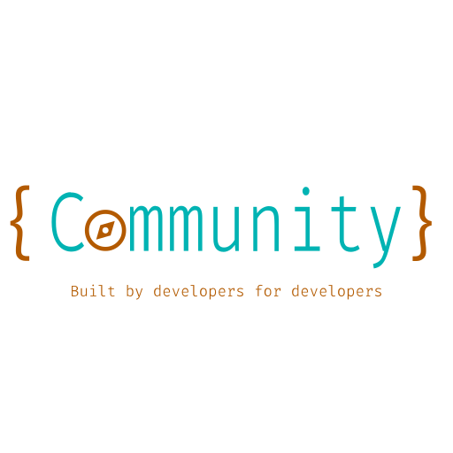

## معرفی
هدف این نوشتار، معرفی یک سری دستورعمل کاربردی و عمومی برای بهبود ارتباطات بین افراد جامعه ی برنامه نویسی/فنی ست. هرچند بیشتر قسمت های متن،‌تنها مختص جوامع فنی نیست،‌اما توجه اصلی معطوف آن قسمت بوده.

##  چگونه استفاده کنیم؟
### (برای community ها)
- درباره ی این دستورعمل ها بین دوستانتون صحبت کنید.
- با توجه به اهداف و مسیر جمع خودتون، قسمت های لازم رو تغییر بدید
-  یک نسخه ی شخصی سازی شده برای گروه خودتون ایجاد کنید.
## چطور کمک کنیم؟
**برای افراد دغدغه مند** که به کل گروه ها فکر میکنند.

- ازین مخزن فورک بگیرید 
- تغییر مدنظرتون رو اضافه کنید.
- در نهایت pull request باز کنید.

#### **سوالاتی که میتونن ذهن جست و جو گر شما رو به حرکت بندازند:**
- وقتی من در یک گروه هستم،
	+ چه ارزشی میتونم به جمع اضافه کنم اما با شرایط فعلی ممکن نیست؟
	+ چه کار های جمعی میل دارم انجام بدیم، اما با شرایط فعلی بعید میدونم بشه؟
- ... 
### **تشکر و قدردانی**
- این نوشته بدون ایده گرفتن از منابع زیر ممکن نبود؛
[مرامنامه](https://shirazlug.ir/about/creed/) ی شیرازلاگ و [ شیرازلاگ](https://shirazlug.ir) که مفهوم جامعه ی کاربری نرم افزار آزاد و متن باز رو به من یاد داد.
و همچنین [contributor covenant](https://www.contributor-covenant.org/version/2/1/code_of_conduct/) 

- از @iKeramat، پیشگام pr و ایده و طرح زیبای بالای صفحه:)
-  از @metemaddar که مشتاقانه پیگیرایده اولیه شد.
